# AI Context Engine (ACE)

[](https://github.com/Dw-Dwain/Ace-Context-MCP/actions/workflows/ci.yml) [](https://glama.ai/mcp/servers/Dw-Dwain/Ace-Context-MCP)     

**Persistent, local-first memory for your AI chats.** Save context in one chat, load it in another — across Claude web, Claude Code, Cursor, Cline, and Claude Desktop. One store, on your own disk, reachable from every tool via MCP, CLI, REST, or SDK.

> Leave a chat and it's gone. A fresh session anywhere starts blank. The only thing that survives is what you saved to ACE — and that local copy is the source of truth the next session pulls back in. Each session ties into the last.



## Install

### Fastest — no clone, no build ([npm](https://www.npmjs.com/package/ace-context-mcp))

Add to your MCP client config (Claude Desktop, Cursor, Cline, …):

```json
{
  "mcpServers": {
    "ace": { "command": "npx", "args": ["-y", "ace-context-mcp"] }
  }
}
```

Restart the client. `context_save` / `context_load` / `context_search` / `context_list` / `context_forget` are now available. Set `ACE_HOME` to change the store location (default `~/.ace/store`).

### From source (also gives you the `ace` CLI + one-command install)

```bash
git clone https://github.com/Dw-Dwain/Ace-Context-MCP.git
cd Ace-Context-MCP
pnpm install
pnpm -r build

# plug it into your AI tool (pick one; all read the same store)
node packages/cli/bin/ace.js mcp install --client=claude-code
node packages/cli/bin/ace.js mcp install --client=claude-desktop
node packages/cli/bin/ace.js mcp install --client=cursor
node packages/cli/bin/ace.js mcp install --client=cline
```

Restart the client, then in any chat: *"save this thread as project/x"* / *"load project/x"* / *"search my contexts for …"*.

---


Leave a chat and it's gone — a fresh session anywhere starts blank. The only thing that survives is what you stored in ACE. That local copy is the source of truth the next session pulls back in, so each session ties into the last. Different topics live in different named slots. See [ARCHITECTURE.md](ARCHITECTURE.md) for the full model and [docs/DESIGN-DECISIONS.md](docs/DESIGN-DECISIONS.md) for the trade-offs.

## Cross-session continuity (the whole point)

```bash
# End of a session in Claude Code — stash what mattered
ace save project/auth-refactor --from-clipboard

# Next day, fresh chat in Claude Desktop / Cursor / web — catch it up
ace load project/auth-refactor --shape summary --budget 8000
#   ...or, if you forget the slug:
ace search "what did we decide about session tokens"
```

- **One brain across every tool.** Point every client at the same store by setting `ACE_HOME` (default `~/.ace/store`) identically — CLI, MCP server, and SDK all read it. Desktop, web, Cursor, Cline, and the terminal share the same slots.
- **Many topics, many slots.** Slugs are namespaced paths (`project/x`, `research/y`, `personal/z`). Re-saving a slug merges + dedups, so a slot grows across sessions instead of overwriting.
- **Fits any window.** `load` returns the largest shape that fits `--budget`, so a 1M-token session and an 8k one both get a right-sized payload.

**Status: v0.1.0 — M1–M14 complete.** The context store (save/load/search/extract, MCP + CLI + REST) and the full LLM proxy pipeline (routing, cache, optimizer, compression, security, policy, learning, observability). 120 tests across 15 packages. Everything works offline by default; heavier implementations sit behind stable interfaces. See [ARCHITECTURE.md](ARCHITECTURE.md), [docs/DESIGN-DECISIONS.md](docs/DESIGN-DECISIONS.md), [docs/PLUGINS.md](docs/PLUGINS.md), and [CHANGELOG.md](CHANGELOG.md).

## Try it now

```bash
pnpm install
pnpm -r build

# End-to-end demos (each uses a scratch ACE_HOME, cleans itself up)
pnpm demo:m1   # save/load/list/forget via the SDK
pnpm demo:m4   # spawn ace-mcp over stdio and drive it as an MCP client
```

## Wire it into your chat client (M4)

```bash
# One-command install — pick your client
node packages/cli/bin/ace.js mcp install --client=claude-desktop
node packages/cli/bin/ace.js mcp install --client=cursor
node packages/cli/bin/ace.js mcp install --client=cline
node packages/cli/bin/ace.js mcp install --client=claude-code
```

Restart the client and `context_save` / `context_load` / `context_search` / `context_list` / `context_forget` appear as tools any conversation can call.

Config files written (one `mcpServers.ace` entry each):
- **claude-desktop** — `%APPDATA%\Claude\claude_desktop_config.json` (Win) / `~/Library/Application Support/Claude/…` (macOS) / `~/.config/Claude/…` (Linux)
- **cursor** — `~/.cursor/mcp.json`
- **claude-code** — `~/.claude.json`
- **cline** — VS Code `globalStorage/saoudrizwan.claude-dev/settings/cline_mcp_settings.json`

The command is idempotent, preserves existing `mcpServers` entries, and backs up the previous file before writing.

## CLI

```bash
# Save context — from a file, stdin, clipboard, or --text
node packages/cli/bin/ace.js save project/auth-refactor --text "we decided to use JWT with 15m expiry"
cat notes.md | node packages/cli/bin/ace.js save notes/today
node packages/cli/bin/ace.js save today/thread --from-clipboard --tag urgent

# Load into any chat — engine picks the largest shape that fits your budget
node packages/cli/bin/ace.js load project/auth-refactor --shape summary --budget 4000

# Semantic search across everything you've saved
node packages/cli/bin/ace.js search "what did we decide about session tokens"
node packages/cli/bin/ace.js search "caching strategy" --scope project/ --top-k 3

# List with filters
node packages/cli/bin/ace.js list --prefix project/ --tag auth

# Forget (moves to trash by default)
node packages/cli/bin/ace.js forget project/auth-refactor
node packages/cli/bin/ace.js forget project/auth-refactor --purge
```

Override the storage location with `ACE_HOME` (defaults to `~/.ace/store`).

## SDK

```ts
import { Engine } from '@ace/core';
import { Store, storeMiddleware } from '@ace/store';

const store = new Store();                        // uses ACE_HOME or ~/.ace/store
const engine = new Engine().use(storeMiddleware(store));

await engine.run({
  kind: 'save',
  input: { slug: 'project/auth', source: { text: '...' }, hints: { tags: ['auth'] } },
});
const res = await engine.run({
  kind: 'load',
  input: { slug: 'project/auth', shape: 'summary', budgetTokens: 4000 },
});
```

Every operation returns a `trace` — an array of decisions each middleware made, with timing. No hidden math.

## Server + dashboard (M13)

```bash
pnpm serve          # builds @ace/server and starts it on http://127.0.0.1:4319
```

- REST: `POST /v1/contexts`, `GET /v1/contexts/:slug`, `POST /v1/contexts/search`, `GET /v1/contexts`, `DELETE /v1/contexts/:slug`.
- Observability: `GET /metrics` (Prometheus), `GET /v1/traces` (recent runs with per-stage decisions), and a live dashboard at `/` (request counts, cache-hit rate, recent-request table) — self-contained HTML, no build step.

## Layout

| Package | Role |
|---|---|
| `@ace/core` | Engine + middleware kernel + types + tracing |
| `@ace/store` | On-disk context store (SQLite index, markdown content) |
| `@ace/embeddings` | Provider-agnostic embeddings (hash default, Ollama opt-in) |
| `@ace/extract` | Thread → decisions / facts / snippets / summary |
| `@ace/cache` | Exact + semantic cache with an explainable confidence engine |
| `@ace/optimize` | Prompt optimizer with a rewrite safety rail |
| `@ace/compress` | Budget-triggered conversation compression |
| `@ace/router` | Provider adapters (Anthropic, OpenAI/OpenRouter/Ollama/Gemini, mock) + routing/failover/streaming |
| `@ace/security` | Secret / PII / prompt-injection scanning + redaction |
| `@ace/policy` | Allow/deny, rate-limit, token-budget enforcement |
| `@ace/learn` | Feedback-signal quality scoring + cache-threshold tuning |
| `@ace/observe` | Metrics, trace log, observability middleware |
| `@ace/mcp` | MCP server (`ace-mcp`) exposing the store to any chat client |
| `@ace/cli` | The `ace` binary (save/load/search/list/forget/mcp install) |
| `apps/server` | Fastify REST server + live dashboard |

`demos/` holds per-milestone runnable demos (`pnpm demo:m1` … `demo:m11`).

## License

Apache-2.0.

## LLM proxy pipeline (M5)

The engine also fronts raw LLM calls, so an app gets routing, failover, and (in later milestones) caching/optimization for free:

```ts
import { Engine } from '@ace/core';
import { Router, AnthropicProvider, MockProvider,
         normalizeChatMiddleware, validateChatMiddleware, routerMiddleware } from '@ace/router';

const router = new Router({
  providers: [new AnthropicProvider(), new MockProvider()],
  rules: [{ when: (m) => m === 'auto' || m.startsWith('claude'), use: 'anthropic', fallbacks: ['mock'] }],
});

const engine = new Engine()
  .use(normalizeChatMiddleware())
  .use(validateChatMiddleware())
  .use(routerMiddleware(router));

const res = await engine.chat({ messages: [{ role: 'user', content: 'hi' }], model: 'auto' });
```

Providers implement one interface (`chat(ProviderRequest): Promise<ProviderResponse>`); the Anthropic adapter is the only file importing a vendor SDK. Routing rules pick a provider by model and fail over down a chain — every attempt lands on the trace. `pnpm demo:m5` runs it against a mock (set `ANTHROPIC_API_KEY` to hit a real model).

## Extraction

On save, a raw chat thread (a `Role:`-prefixed transcript, or a structured message array) is distilled into:

- **decisions** — sentences with decision cues ("we decided", "let's go with", "decision:", "agreed to", …)
- **facts** — bullet-point statements, deduplicated
- **snippets** — fenced code blocks, named and language-tagged
- **summary** — the opening ask plus thread shape

These populate the layered load shapes: `summary` returns summary+decisions+facts; `working` adds snippets+files; `full` adds the raw thread. Re-saving the same slug merges and dedups decisions/facts. Opt out with `ace save --no-extract` or `hints.extract: []`. Extraction is heuristic and offline — swap in an LLM pass later without changing the store.

## Semantic search

`ace search` (and the `context_search` MCP tool) embeds your query and ranks chunks of every saved context by cosine similarity. Three tiers, auto-selected best-first — nothing required to start:

| Tier | Quality | Setup |
|---|---|---|
| **hash** (default) | keyword / lexical overlap — shared words, not meaning | none — offline, zero-dep |
| **local model** | **true semantic** (`car` ≈ `automobile`) | `pnpm enable:semantic` — transformers.js all-MiniLM, runs in-process, downloads once |
| **Ollama** | true semantic, GPU-capable | run [Ollama](https://ollama.com) with `nomic-embed-text` |

> **Out of the box, search is keyword-based.** For paraphrase-aware semantic search, run `pnpm enable:semantic` once **or** point it at Ollama — both auto-detected, no code change. The base install stays lean (zero native ML deps) by design.

The CLI/MCP/server entry points pick the best available (Ollama → local model → hash). Save and search use the **same** provider so vectors stay comparable; mismatched chunks are skipped with a reindex hint. Vectors are blobs in the SQLite index; matching is a brute-force cosine scan — fast at personal-store scale; swap in sqlite-vec / pgvector when chunk counts get large.

## On-disk shape

```
$ACE_HOME/
├── contexts/<slug>/
│   ├── manifest.json     # metadata, version, token counts, section pointers
│   ├── summary.md        # the load-shape 'summary' body
│   ├── decisions.md      # (populated by extractor in M3)
│   ├── facts.md          # (populated by extractor in M3)
│   ├── snippets/         # (populated by extractor in M3)
│   ├── files/            # attached files, copied not linked
│   ├── refs.json         # external URLs
│   └── raw/thread.md     # optional full source
├── trash/                # `forget` moves here (recoverable) unless --purge
└── index.db              # SQLite metadata index (rebuildable via Store#rebuildIndex)
```

Everything is human-readable. Grep, diff, and commit the store to git if you want cross-machine sync today.
